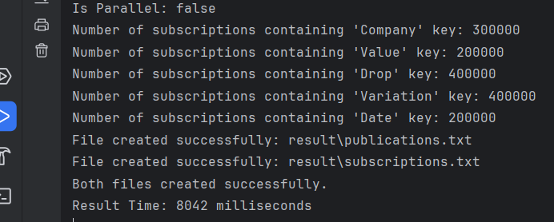
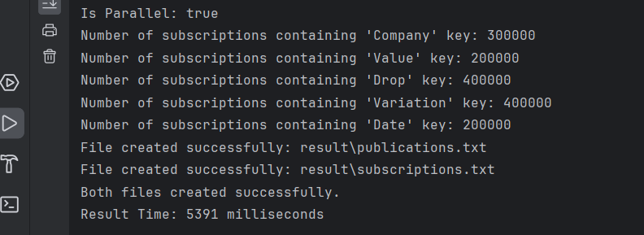
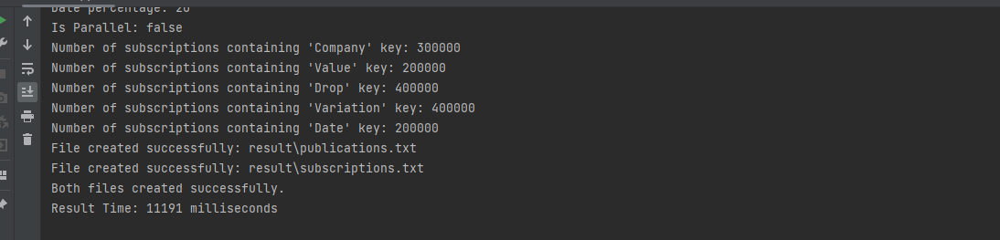
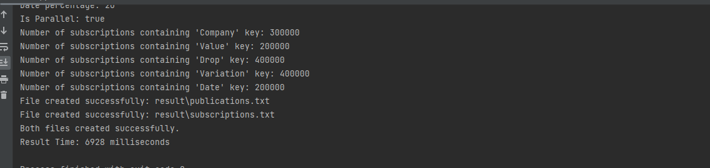

## Descriere
Scrieti un program care sa genereze aleator seturi echilibrate de subscriptii si publicatii cu posibilitatea de fixare a: numarului total de mesaje (publicatii, respectiv subscriptii), ponderii pe frecventa campurilor din subscriptii si ponderii operatorilor de egalitate din subscriptii pentru cel putin un camp. Publicatiile vor avea o structura fixa de campuri. Implementarea temei va include o posibilitate de paralelizare pentru eficientizarea generarii subscriptiilor si publicatiilor, si o evaluare a timpilor obtinuti.

### Exemplu:  
Publicatie: {(company,"Google");(value,90.0);(drop,10.0);(variation,0.73);(date,2.02.2022)} - Structura fixa a campurilor publicatiei e: company-string, value-double, drop-double, variation-double, date-data; pentru anumite campuri (company, date), se pot folosi seturi de valori prestabilite de unde se va alege una la intamplare; pentru celelalte campuri se pot stabili limite inferioare si superioare intre care se va alege una la intamplare.  
  
Subscriptie: {(company,=,"Google");(value,>=,90);(variation,<,0.8)} - Unele campuri pot lipsi; frecventa campurilor prezente trebuie sa fie configurabila (ex. 90% company - 90% din subscriptiile generate trebuie sa includa campul "company"); pentru cel putin un camp (exemplu - company) trebui sa se poate configura un minim de frecventa pentru operatorul "=" (ex. macar 70% din subscriptiile generate sa aiba ca operator pe acest camp egalitatea).

## Tipul de Paralelizare: Threads

## Generare publicatii si subscriptii

### Procesor Opariuc Rares Ioan
- Procesor: 13th Gen Intel(R) Core(TM) i7-1355U 1.70 GHz
#### Fara Paralelizare
- Numărul de Threads pubs: 1
- Numarul de Threads subs: 1
- Numărul de publicatii si subscriptii: 2.000.000 (1 milion fiecare)
- Timpul de Execuție Mediu: ~8.04 secunde
 
 

#### Cu Paralelizare
- Numărul de Threads pubs: 1000 (100 de pubs per thread)
- Numarul de Threads subs: 5
- Numărul de publicatii si subscriptii: 2.000.000 (1 milion fiecare)
- Timpul de Execuție Mediu: ~5.39 secunde
 
 

### Procesor Savin Rares-Emil
- Procesor: Intel(R) Core(TM) i5-8250U CPU @ 1.60GHz
#### Fara Paralelizare
- Numărul de Threads pubs: 1
- Numarul de Threads subs: 1
- Numărul de publicatii si subscriptii: 2.000.000 (1 milion fiecare)
- Timpul de Execuție Mediu: ~11.91 secunde

 

#### Cu Paralelizare
- Numărul de Threads pubs: 1000 (1000 de pubs per thread)
- Numarul de Threads subs: 5
- Numărul de publicatii si subscriptii: 2.000.000 (1 milion fiecare)
- Timpul de Execuție Mediu: ~6.92 secunde

 
